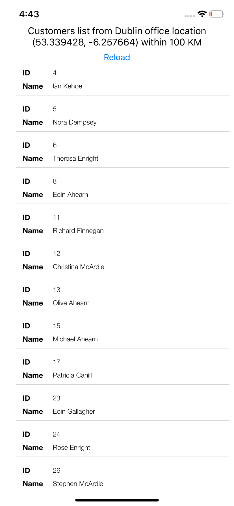
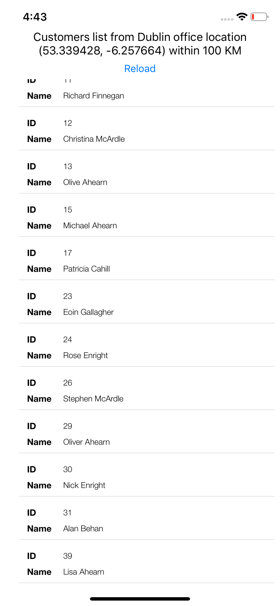

# CustomerFinder
Sample project to search by the nearest customer within 100 KM in customers list and filter them ascending.
Coding language: SWIFT 4
Architectural pattern used: Model–view–viewmodel (MVVM).
Haversine formula used to calc the distance https://en.wikipedia.org/wiki/Haversine_formula 

ScreenShots 
Part1:

Part2:

